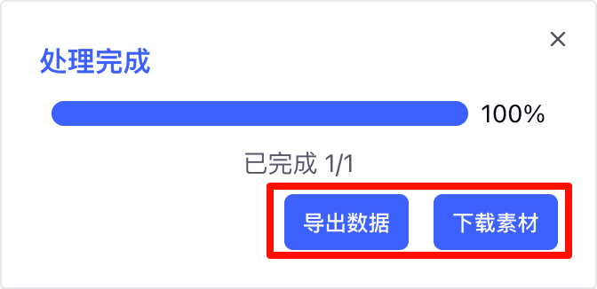

# 快手功能说明

社媒助手开源版[快手](https://www.kuaishou.com)平台的功能说明

## 植入功能

### 快手达人详情页

植入内容位于快手的达人详情页：`https://www.kuaishou.com/profile/{id}`

#### 复制达人信息

点击后会复制当前达人的信息到剪贴板，用户可在任意位置粘贴。

#### 导出视频数据

点击后会弹框提示用户进行导出，导出结果与`根据达人链接批量导出视频数据`相同

### 快手视频详情页

#### 下载无水印视频

点击后会下载当前视频的无水印文件。

#### 复制视频信息

点击后会复制当前视频的信息到剪贴板，用户可在任意位置粘贴。

#### 导出评论

点击后会弹框提示用户进行导出，导出结果与`根据视频链接批量导出评论数据`相同

#### 导出合集

如果当前视频属于某个合集，则会出现此按钮，点击后将采集当前合集的所有视频。

## 批量功能

批量采集功能入口位于Popup页

批量采集完成后会有两个操作按钮，一个是导出Excel文件，另一个是下载图片、视频等媒体文件。

### 批量采集达人

- 达人主页链接：`https://www.kuaishou.com/profile/`开头的URL链接，一行一个

### 批量采集视频

#### 根据视频链接采集

- 视频链接：PC端视频详情页链接，一行一个

#### 根据达人链接采集

- 达人主页链接：`https://www.kuaishou.com/profile/`开头的URL链接，一行一个
- 导出数量：每位达人需要导出的视频数

### 批量采集评论

- 视频链接：PC端视频详情页链接，一行一个
- 导出数量：每条视频需要导出的评论数