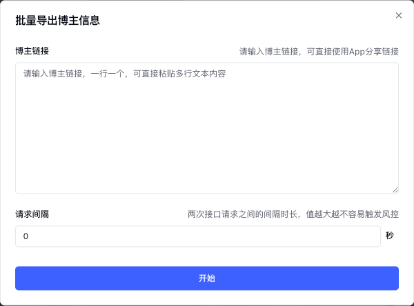

# 小红书功能说明

社媒助手开源版[小红书](https://www.xiaohongshu.com)平台的功能说明

## 植入功能

### 小红书博主详情页

植入内容位于小红书的博主详情页：`https://www.xiaohongshu.com/user/profile/{博主ID}`

#### 复制博主信息

点击后会复制当前博主的信息到剪贴板，用户可在任意位置粘贴。

#### 导出笔记数据

点击后会弹框提示用户进行导出，导出结果与`根据博主链接批量导出笔记数据`相同

### 小红书笔记详情页

#### 下载笔记视频/图片

点击后会下载当前笔记的无水印视频/图片文件。

#### 复制笔记信息

点击后会复制当前笔记的信息到剪贴板，用户可在任意位置粘贴。

#### 导出评论

点击后会弹框提示用户进行导出，导出结果与`根据笔记链接批量导出评论数据`相同

## 批量功能

批量采集功能入口位于Popup页

批量采集完成后会有两个操作按钮，一个是导出Excel文件，另一个是下载图片、视频等媒体文件。

### 批量采集博主

- 博主主页链接：以`https://www.xiaohongshu.com/user/profile/`开头的URL链接，一行一个

### 批量采集笔记

#### 根据笔记链接采集

- 笔记链接：PC端笔记详情页链接，一行一个

#### 根据博主链接采集

- 博主主页链接：以`https://www.xiaohongshu.com/user/profile/`开头的URL链接，一行一个
- 导出数量：每位博主需要导出的笔记数

### 批量采集评论

- 笔记链接：PC端笔记详情页链接，一行一个
- 导出数量：每条笔记需要导出的评论数