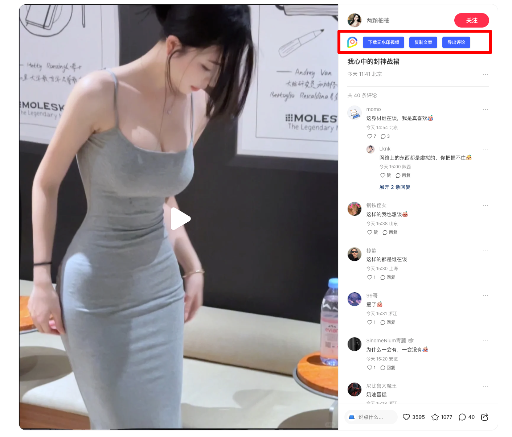
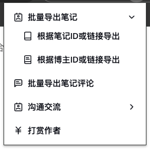
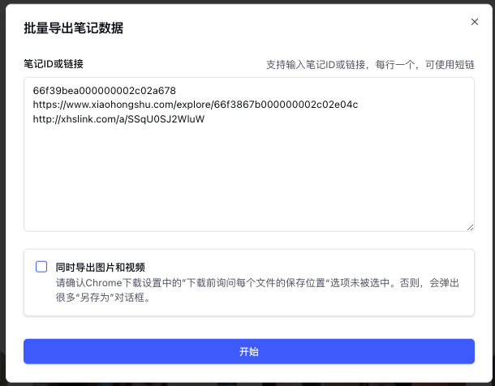
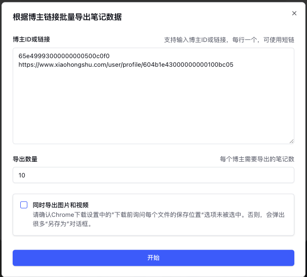
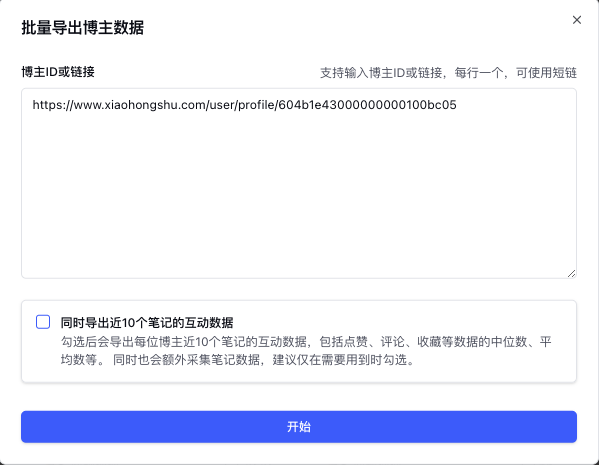
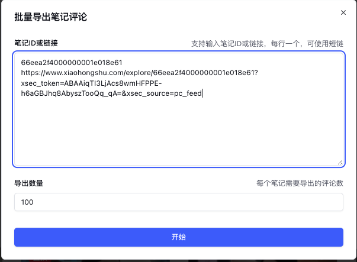

# 小红书

## 笔记详情页

进入到小红书web端笔记详情页，会在笔记页植入便捷操作入口。如图所示：

目前植入的功能：下载无水印视频/图片、文案复制、导出评论等

## 博主详情页

进入到小红书web端博主详情页，会在博主页植入便捷操作入口。如图所示：

目前植入的功能：打开蒲公英主页、复制博主信息、导出笔记数据等

## 批量操作

点击插件图标（植入页的图标或右上角插件图标均可）即可展示当前支持的批量操作功能

❗️批量操作最好一次性不要导出过多数据，否则容易触发平台风控而导致任务异常！

### 批量导出笔记

#### 根据笔记ID或链接导出

同时支持输入3种内容进行导出，笔记ID、笔记短链（从APP分享出来的链接）、笔记长链（PC端的笔记详情页）。多篇笔记之间通过换行进行分隔

可按需选择是否需要同时导出笔记的视频和图片，如果勾选，建议关闭浏览器的每次下载询问保存位置功能，否则会频繁弹出下载对话框。

#### 根据博主ID或链接导出

与 根据笔记ID或链接导出功能 类似，只是输入的内容变成了博主的ID或链接。同时多了一个导出数量的选项。也就是每个博主需要导出多少条笔记。

### 批量导出博主数据

与 根据笔记ID或链接导出笔记 类似，只是输入的内容变成了博主ID或链接，同时导出的数据变成了博主信息。

> [!IMPORTANT]
> 由于小红书平台的笔记，想要获取到互动数据，必须请求每一篇笔记的详情才能获取到相应数据。所以建议尽量不要勾选导出近10篇笔记的互动数据选项，勾选后，每位博主都将增加大约10次接口请求。

### 批量导出笔记评论

与 根据博主ID或链接导出 类似，只是输入的内容变成了笔记ID或链接，同时导出的数据变成了评论。

