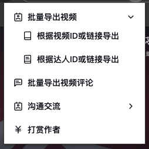
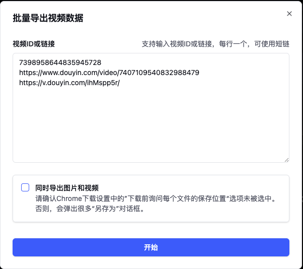
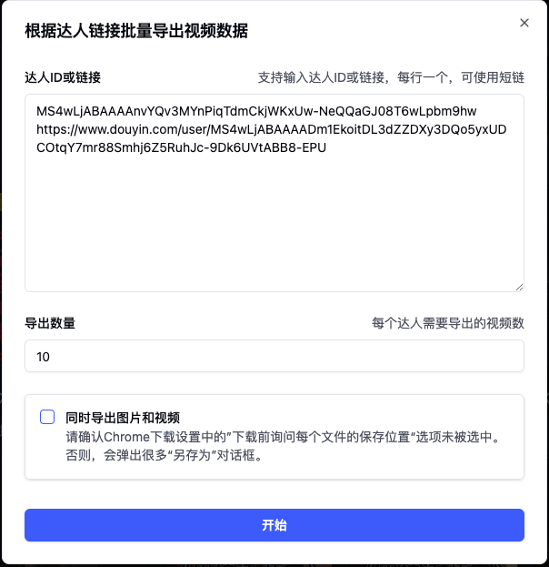
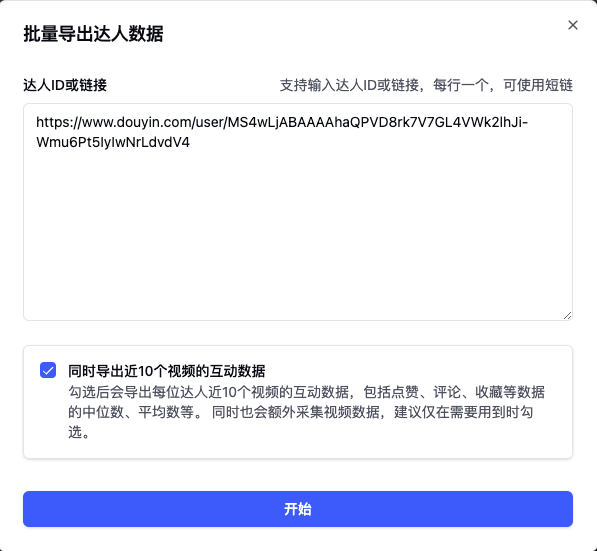
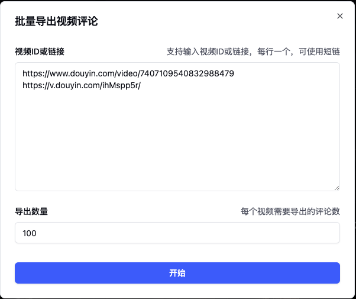

# 抖音

## 视频详情页

进入到抖音web端视频详情页，会在视频页植入便捷操作入口。如图所示：

目前植入的功能：下载无水印视频/图片、导出评论等

## 达人详情页

进入到抖音web端达人详情页，会在达人页植入便捷操作入口。如图所示：

目前植入的功能：打开星图主页、复制达人信息、导出视频数据等

## 批量操作

点击插件图标（植入页的图标或右上角插件图标均可）即可展示当前支持的批量操作功能

❗️批量操作最好一次性不要导出过多数据，否则容易触发平台风控而导致任务异常！

### 批量导出视频

#### 根据视频ID或链接导出

同时支持输入3种内容进行导出，视频ID、视频短链（从APP分享出来的链接）、视频长链（PC端的视频详情页）。

多篇视频之间通过换行进行分隔

可按需选择是否需要同时导出视频的视频和图片，如果勾选，建议关闭浏览器的每次下载询问保存位置功能，否则会频繁弹出下载对话框。

#### 根据达人ID或链接导出

与 根据视频ID或链接导出功能 类似，只是输入的内容变成了达人的ID或链接。同时多了一个导出数量的选项。也就是每个达人需要导出多少条视频。

### 批量导出达人数据

与 根据笔记ID或链接导出笔记 类似，只是输入的内容变成了博主ID或链接，同时导出的数据变成了博主信息。

> 抖音平台互动数据不用请求详情即可获取，勾选导出近10条视频的互动数据每位达人只会增加1次请求。

### 批量导出视频评论

与 根据达人ID或链接导出 类似，只是输入的内容变成了视频ID或链接，同时导出的数据变成了评论。

